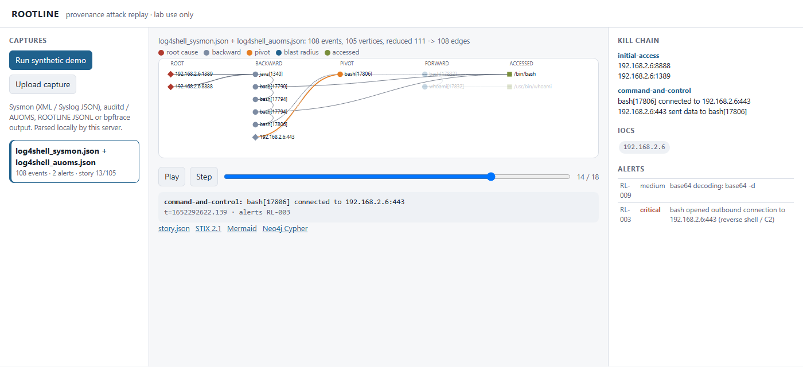
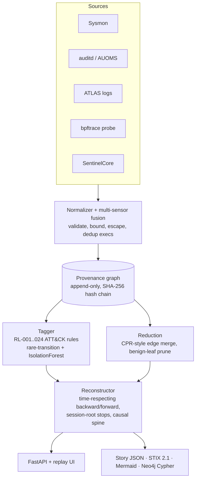
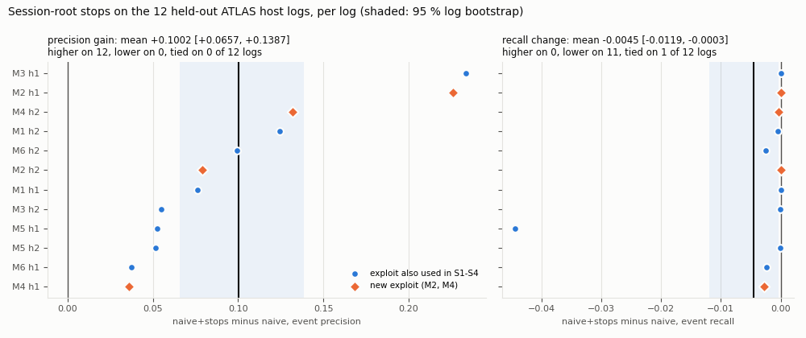
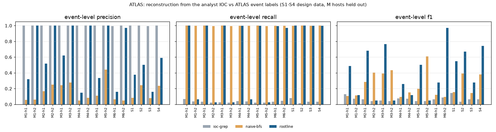
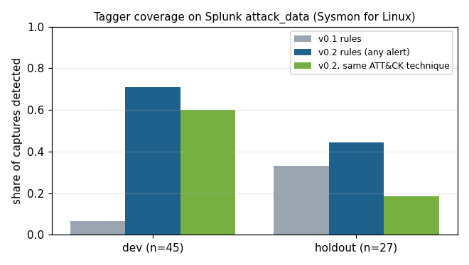

# ROOTLINE

[](https://github.com/rakshit-737/rootline-provenance-forensics/actions/workflows/ci.yml)
[](https://rakshit-737.github.io/rootline-provenance-forensics/)
[](https://github.com/rakshit-737/rootline-provenance-forensics/releases)

[](LICENSE)


**A small, explainable provenance-graph engine that reconstructs host attacks from syscall-level telemetry: give it an alert or an IOC and it traces back to the root cause and forward to the blast radius.**

**Contribution.** ROOTLINE is a training-free, explainable provenance reconstructor whose session-root stops raise event precision on held-out ATLAS host logs by +0.10 [0.07, 0.14] (higher on 12 of 12 logs) at essentially unchanged recall, with the full sensor-to-story path exercised on a live kernel in CI.

It does not match ATLAS's supervised model, and its rule tagger does not generalise; both are measured below. Every number in this table is rendered from committed JSON by `scripts/render_tables.py` ([`results/TABLES.md`](results/TABLES.md)), and a test keeps this table identical to it.

| Result | Number | Source (`results/`) |
|---|---|---|
| ATLAS S1-S4 (design data): full method vs naive reachability, event F1 | **0.66** vs 0.25, higher on 4 of 4 logs (per-log 0.42-0.78 vs 0.15-0.39; ΔF1 +0.41, t(3) 95 % CI [+0.24, +0.58]) | `ablation.json`, bench run 37092501921 |
| ATLAS M1-M6 host logs (**held out**): precision / recall / F1, full vs naive | 0.62 / 0.72 / 0.46 vs 0.26 / 0.98 / 0.33; F1 higher on 9 of 12 logs, ΔF1 +0.14 [-0.11, +0.35] (sign-flip p = 0.28, not significant) | `ablation.json`, bench run 37092501921 |
| Session-root stops alone, held out | precision **+0.10** [+0.07, +0.14], higher on 12 of 12 logs (exact sign test p = 0.00049); recall -0.0045 [-0.0119, -0.0003] | `ablation.json`, bench run 37092501921 |
| Same, only the 4 held-out logs whose exploit is not in S1-S4 (M2, M4) | precision +0.12, higher on 4 of 4 logs (descriptive) | `ablation.json`, bench run 37092501921 |
| ATLAS paper's graph-traversal baseline vs ROOTLINE naive reachability, event precision | 0.18 vs 0.15 / 0.26: consistent | paper Table 5; `ablation.json`, bench run 37092501921 |
| ATLAS LSTM, our reproduction (entity F1, S1-S4, mean of 5 seeds) | 0.24-0.75 vs ATLAS's cleaned list under our scorer 0.86-1.00 (paper 0.89-1.00): **not reproduced** | `atlas_repro.json`, atlas-repro run 36997669262 |
| Rule tagger v0.3: in-sample dev2 vs sealed, captures detected | 23/27 [0.68, 0.94] vs **4/64 [0.02, 0.15]** | `coverage.json`, sealed-coverage run 36994398382 |
| Live bpftrace probe on a GitHub-hosted kernel | 71/72 CI jobs pass over 15 pushes [0.925, 0.998]; chain recovered in **one query** in 72/72 [0.95, 1.00] | `live_ebpf.json`, ci runs 36996901332..37003827535 |
| Graph reduction (16 ATLAS logs) | 3.8-5.8x fewer edges, lossless by design | `atlas.json`, bench run 37092501921 |

Intervals are 95 %: log-cluster bootstrap for the held-out logs, Wilson for counts. "Held out" means unseen host logs from the same ATLAS testbed; 8 of the 12 replay an exploit that S1-S4 also use, which is why the row for the two attacks with a new exploit is listed separately.



**Docs:** <https://rakshit-737.github.io/rootline-provenance-forensics/> · **Replay UI (static):** <https://rakshit-737.github.io/rootline-provenance-forensics/demo/> · [How it works](https://rakshit-737.github.io/rootline-provenance-forensics/how-it-works/) · [Evaluation](https://rakshit-737.github.io/rootline-provenance-forensics/evaluation/) · [Reproduce](https://rakshit-737.github.io/rootline-provenance-forensics/reproduce/)

## Try it in 60 seconds

```bash
docker run --rm -p 127.0.0.1:8000:8000 ghcr.io/rakshit-737/rootline-provenance-forensics:latest
# open http://127.0.0.1:8000 - the replay UI, preloaded with the OTRF Log4Shell capture
```

Or without Docker (Python 3.10+; the core needs no third-party packages):

```bash
git clone https://github.com/rakshit-737/rootline-provenance-forensics && cd rootline-provenance-forensics
pip install -e .
rootline analyze tests/fixtures/log4shell_sysmon.json tests/fixtures/log4shell_auoms.json
```

The complete output (deterministic, about 0.4 s):

```text
[+] graph: {'events': 108, 'nodes': 105, 'edges': 111, 'process': 83, 'socket': 5, 'file': 17}  (rejected records: 0)
[+] reduction: {'edges_before': 111, 'edges_after': 108, 'nodes_before': 105, 'nodes_after': 96, 'edge_ratio': 1.03}
[+] alerts: 2
    RL-009  medium   T1140      base64 decoding: base64 -d
    RL-003  critical T1071      bash opened outbound connection to 192.168.2.6:443 (reverse shell / C2)

[*] pivot: RL-003 on bash[17806]
[*] root cause(s): ['192.168.2.6:8888', '192.168.2.6:1389']
[*] story: 13 nodes / 18 edges (backward 9, forward 4, accessed 2)
[*] kill chain:
    initial-access: 192.168.2.6:8888  (+1 more)
    command-and-control: bash[17806] connected to 192.168.2.6:443  (+1 more)
[*] IOCs: {"ip": ["192.168.2.6"], "ipv4": ["192.168.2.6"], "ipv6": [], "files": [], "sha256": []}
[*] integrity head: d1b6e3cde1f07bcf93a670231d4002586cfbab5a7aa3b935a75b910176898656
```

The reverse shell traces back through `java[1340]` to the attacker's LDAP (`:1389`) and HTTP (`:8888`) callbacks, which is the JNDI exploitation chain. The two files are the full OTRF capture from two sensors on one host (Sysmon for Linux and AUOMS), fused. The integrity head is the SHA-256 hash-chain head of the provenance record; `rootline verify` checks it.

## Architecture



| Module | File | What it does |
|---|---|---|
| Probe | `probes/rootline.bt` | bpftrace, JSON records, PID self-filter, fd→path for writes, IPv4/IPv6 connect. Run live in CI ([ADR 0008](docs/adr/0008-live-ebpf-in-ci.md)) |
| Loaders | `loaders/` | Sysmon (XML, Syslog-JSON, syslog-prefixed), raw auditd grouped by serial, AUOMS, ATLAS line-labelled logs; formats sniffed; `merge_sources()` fuses sensors |
| Graph | `graph.py` | One vertex per process *image* (PID reuse is safe); edges follow information flow; every event extends a hash chain ([ADR 0001](docs/adr/0001-process-image-vertices.md)) |
| Reduction | `reduce.py` | Merges repeated edges unless new input arrived in between (CPR); lossless for causality ([ADR 0003](docs/adr/0003-causality-preserving-reduction.md)) |
| Tagger | `detect.py`, `rules_linux.py`, `rules_v03.py`, `anomaly.py` | 24 ATT&CK-mapped rules (v0.3 default), a rare-transition model, IsolationForest (`[ml]`) |
| Reconstructor | `reconstruct.py`, `ablation.py` | Time-respecting traversal ([King & Chen 2003](docs/adr/0002-time-respecting-traversal.md)), session-root stops, entry-point ranking, causal spine, IOCs; every component can be switched off for the ablation |
| Export | `export.py` | `rootline.story/v1` JSON with the integrity head, STIX 2.1 (validated with `stix2` in tests), Mermaid, Neo4j Cypher; all telemetry text escaped |
| API / UI | `api.py`, `web/index.html` | Upload a capture, list stories, step through the replay, download STIX; loopback-only, no dependencies in the UI |
| Statistics | `stats.py`, `provenance.py` | Wilson, t and log-cluster bootstrap intervals, exact sign and sign-flip tests; a provenance block (commit, run id) in every result file |

The core engine uses only the standard library ([ADR 0005](docs/adr/0005-stdlib-core-optional-extras.md)). FastAPI, scikit-learn, stix2, matplotlib and torch are optional extras.

## Results

Methodology, every table with its intervals and the comparison with the ATLAS paper are on the [Evaluation](https://rakshit-737.github.io/rootline-provenance-forensics/evaluation/) page. The tables are rendered from committed JSON into [`results/TABLES.md`](results/TABLES.md) by `scripts/render_tables.py`. The ATLAS, ablation and Log4Shell files were generated in GitHub Actions (`bench` run 37092501921 at commit cde2a39) and carry a provenance block.

### 1. Which component buys the precision? (ATLAS ablation)

Every variant runs the same reconstructor with components switched off, from **every** ground-truth entity that maps to a vertex plus ATLAS's own starting IOC. S1-S4 are the scenarios the traversal heuristics were designed on; the 12 per-host logs of M1-M6 were never used for design. Pivots within one log share a graph, so every test is over logs, not pivots.



| Variant | S1-S4 precision | S1-S4 recall | S1-S4 F1 | **Held-out** precision | **Held-out** recall | **Held-out** F1 |
|---|---|---|---|---|---|---|
| naive reachability | 0.15 | 0.94 | 0.25 | 0.26 | 0.98 | 0.33 |
| + session-root stops | 0.26 | 0.94 | 0.39 | 0.36 | 0.98 | 0.46 |
| time-respecting | 0.24 | 0.86 | 0.37 | 0.31 | 0.93 | 0.39 |
| time + stops | 0.31 | 0.86 | 0.45 | 0.40 | 0.93 | **0.51** |
| time + stops + spine (no accessed) | 0.46 | 0.22 | 0.26 | 0.50 | 0.06 | 0.08 |
| **full ROOTLINE** | **0.54** | **0.98** | **0.66** | **0.62** | 0.72 | 0.46 |

Means of per-log means; the per-log values, log-bootstrap intervals (held out) and ranges (S1-S4) are in [`results/TABLES.md`](results/TABLES.md) and in [`results/figures/ablation.png`](results/figures/ablation.png).

What it says:

- **Session-root stops** are the component that transfers to unseen host logs: precision is higher on 12 of 12 held-out logs (exact sign test p = 0.0005, the smallest possible with 12 logs; 33 of 40 pivots higher, 1 lower), by +0.10 [0.07, 0.14], while recall is essentially unchanged (-0.0045 [-0.012, -0.0003], lower on 11 of 12 logs).
- 8 of the 12 held-out logs replay an exploit that S1-S4 also use. On the four logs of the two attacks with a new exploit (M2, M4) the stops add +0.12 precision, higher on 4 of 4 (descriptive); on the other eight, +0.09.
- The causal spine only works together with the "accessed" expansion. On held-out hosts that pair buys precision at a real recall cost. time + stops has the highest held-out F1 point estimate (0.51 vs 0.46 for full, +0.04 [-0.14, 0.26], higher on 5 of 12 logs), so it is not a significant winner.
- Root-cause hit@3 ranges from 0.40 to 0.50 across variants, so entry-point ranking is the weakest part.
- On S1-S4, four logs are too few for a distribution-free test (the smallest exact p is 0.125). The full method's F1 is higher than naive's on all four (paired t(3) = 7.48).

### 2. Comparison with the ATLAS paper (USENIX Security 2021)

| System | Level | Labels used | Precision | Recall | F1 |
|---|---|---|---|---|---|
| ATLAS Table 5: graph-traversal baseline (10 attacks) | event | no | 0.178 | 1.000 | 0.303 |
| ROOTLINE naive reachability (S1-S4 / held-out M hosts) | event | no | 0.15 / 0.26 | 0.94 / 0.98 | 0.25 / 0.33 |
| ROOTLINE full (S1-S4 / held-out M hosts) | event | no | 0.54 / 0.62 | 0.98 / 0.72 | 0.66 / 0.46 |
| ATLAS Table 4: LSTM (10 attacks) | event | yes | 0.999 | 0.999 | 0.999 |

ROOTLINE's naive reachability lands where the paper's own traversal baseline does. The supervised model is far better on paper. We tried to reproduce it with a PyTorch reimplementation of the ATLAS LSTM (`repro/atlas_repro.py`, CI run 36997669262). It uses the setup of ATLAS's released code: batch 1 and 8 epochs as in its `atlas.py`, sequence length 400, 5 seeds. Mean entity F1 per scenario is 0.30-0.65 with a regenerated training set and 0.24-0.75 with ATLAS's shipped training set; per-seed ranges are in `results/TABLES.md`.

Our scorer counts ROOTLINE's abstracted entity set (652 entities for S1, against 7,467 in the paper's Table 4). The like-for-like reference is therefore ATLAS's own cleaned entity list under our scorer: F1 0.86-1.00, against the paper's 0.89-1.00. ATLAS's shipped raw model output scores 0.33-0.71. ATLAS's released `evaluate.py` scores a manually entered "cleaned" list (the script stops until one is filled in), and for S1 the shipped list equals the ground truth. **The paper's numbers are not reproduced here**, against either reference.

Caveats on the comparison:

- ROOTLINE can represent 63-73 % of the lines ATLAS labels as attack (no browser or pid-less rows), so a recall against all attack lines would be lower by that factor. The paper's Table 3 attack-event counts equal the `+` line counts for 9 of the 10 attacks; for M-3 they differ by 207.
- The paper starts S-1, S-3, M-5 and M-6 from a malicious host, S-2, S-4, M-1 and M-2 from a leaked file, and M-3 and M-4 from a malicious file. ROOTLINE's IOC runs start from the attacker address, and the ablation uses every entity.
- ATLAS trains leave-one-attack-out on labelled sequences.

### 3. From the analyst IOC, one pivot per log



Starting only from ATLAS's `user_artifact.txt` (the attacker address), on the same graph. Values are means over logs, with a 95 % log bootstrap for the held-out logs and the range over the four in-sample logs. Per-log rows are in [`results/RESULTS.md`](results/RESULTS.md).

| Logs | Method | Precision | Recall | F1 | Story vertices |
|---|---|---|---|---|---|
| S1-S4 (in-sample) | IOC grep (seed + one hop) | 0.998 (0.992-1.000) | 0.040 (0.017-0.079) | 0.077 (0.033-0.146) | 8 |
| | naive reachability | 0.161 (0.079-0.244) | 0.9995 (0.999-1.000) | 0.269 (0.146-0.392) | 5,902 |
| | **ROOTLINE** | **0.408** (0.161-0.590) | **0.999** (0.9957-0.9999) | **0.559** (0.277-0.742) | 3,424 |
| M1-M6 hosts (held out) | IOC grep | 0.999 [0.998, 1.000] | 0.034 [0.027, 0.042] | 0.065 [0.053, 0.080] | 5 |
| | naive reachability | 0.154 [0.095, 0.228] | 0.998 [0.996, 0.999] | 0.250 [0.166, 0.350] | 6,308 |
| | **ROOTLINE** | 0.673 [0.479, 0.857] | 0.597 [0.353, 0.837] | 0.360 [0.196, 0.541] | 2,149 |

On the held-out hosts the result splits. On the six first-hop (h1) hosts ROOTLINE keeps recall above 0.99. On five of the six second-hop (h2) hosts, where the attacker address appears only in a few lateral connections, the story collapses to 12-17 vertices (recall 0.02-0.06). Reduction removes 3.8-5.8x of the edges across all 16 logs. It is lossless by construction (it keeps the first edge of every source-target-relation key), and the empirical check is that stories with and without it are identical.

### 4. Rule coverage: dev / dev2 / sealed (Splunk attack_data)

The v1.0 holdout was burned once its misses were published and used to write v0.3, so it is now `dev2`. A new **sealed** split (160 Linux captures, pinned by LFS SHA-256 at `attack_data@b4573ed3`, selected from the tree listing only) was scored **once** with the frozen v0.3 rules in CI run 36994398382 at commit 60e3561, after a hash check of the rules, loaders and normaliser ([protocol](docs/protocol.md), [ADR 0009](docs/adr/0009-sealed-rule-protocol.md)). The loaders and normaliser were hardened after that run, so the sealed numbers belong to 60e3561 and any re-score at a later commit would be in-sample; CI checks that the freeze holds at 60e3561 and that the rule logic at HEAD is unchanged.



| Split | Captures | Unparsed | v0.3 detected | v0.3 same technique | Alert precision (proxy) |
|---|---|---|---|---|---|
| dev (in-sample) | 46 | 1 | 34/45 [0.61, 0.86] | 27/45 [0.45, 0.73] | 84/105 [0.71, 0.87] |
| dev2 (burned, in-sample) | 27 | 0 | 23/27 [0.68, 0.94] | 14/27 [0.34, 0.69] | 61/166 [0.30, 0.44] |
| **sealed** | 160 | 96 | **4/64** [0.02, 0.15] | **1/64** [0.003, 0.083] | 1/5 [0.04, 0.62] |
| sealed, techniques never seen in dev/dev2 | 73 | 45 | 2/28 [0.02, 0.23] | 0/28 [0.00, 0.12] | 0/2 [0.00, 0.66] |

Wilson 95 % intervals are computed from the counts. Alerts cluster within captures, so the alert-precision intervals are too narrow. The rules do not generalise beyond the captures they were written from, and the frozen loaders cannot parse most of the sealed auditd variants. Both are reported as measured. Technique match is at parent-technique level; 5 of the 73 dev/dev2 captures are malware families, which can never match a technique. Re-scoring dev and dev2 with the current (post-freeze) loaders reproduces all 73 committed rows (`results/coverage_head.json`, in-sample).

### 5. Live kernel evidence (CI)

The `live-ebpf` job runs `probes/rootline.bt` with sudo on the ubuntu-24.04 runner kernel (6.17, bpftrace 0.20.2) while a benign, attack-shaped chain runs entirely inside the runner: a dummy interface carries a TEST-NET "remote" server, `HOME` is a throwaway directory, and the credentials are AWS's documented example key. One query from the dropped script's process finds the download socket `198.51.100.7:8081` and the script as root causes. The same 28-vertex story holds the credential read, the unit and cron-style writes, the history deletion and both listener connections. RL-002..007 fire (RL-002/004/005/006 are required), zero events are lost, and a decoy that renamed itself `bpftrace` is still captured.

Each push runs five matrix jobs. Over the 15 pushes to main from probe v1.2 (0e86829) to 2aad2d0, 71 of 72 completed jobs passed (Wilson 95 % [0.925, 0.998]). The chain was recovered in 72 of 72 (Wilson [0.95, 1.00]). The one failure was an over-strict fork-parent check, since corrected. One row per job, collected from the CI artefacts by `scripts/live/collect_repeatability.py`, is in [`results/live_ebpf.json`](results/live_ebpf.json); the story is in [`results/live_ebpf_story.mmd`](results/live_ebpf_story.mmd). Caveats: this is bpftrace, not a libbpf CO-RE probe; the chain is scripted and benign; relative paths are not resolved.

### 6. Unsupervised process ranking: IsolationForest does not beat a one-line heuristic

Each log's process vertices are ranked without labels and checked against ATLAS's malicious process images ([`results/TABLES.md`](results/TABLES.md)). On the 12 held-out M hosts:

- IsolationForest puts the first malicious process at mean rank 1.87 (recall@10 0.78 [0.64, 0.89]).
- The heuristic "images in a user-writable directory first, then by degree" reaches rank 1.00 and recall@10 0.93 [0.79, 1.00]. It is higher on 8 logs, lower on 1 and tied on 3 (exact sign test p = 0.039; mean difference +0.15, t(11) 95 % CI [-0.02, 0.33]).
- Without its `exec_user_dir` feature, which was written alongside the ATLAS benchmark, IsolationForest falls to recall@10 0.49 (lower on 10 of 12 logs, p = 0.002).

So the model does not outperform that single feature on these logs.

### 7. Sensor fusion: OTRF Log4Shell (CVE-2021-44228)

| Input | Events | Alerts | Story vertices | Root causes | Reaches `java` | Reaches LDAP `:1389` |
|---|---|---|---|---|---|---|
| Sysmon only | 103 | 2 | 10 | none | no | no |
| **Sysmon + AUOMS** | 108 | 2 | 13 | `192.168.2.6:8888`, `192.168.2.6:1389` | **yes** | **yes** |

Sysmon for Linux lacks the network events that link `java` to the payload fetch; fusing AUOMS's `connect` records closes the chain ([ADR 0006](docs/adr/0006-multi-sensor-fusion.md); `results/log4shell.json`, bench run 37092501921).

## Datasets

Downloaded **outside the repository** by `python scripts/download_data.py` into `$ROOTLINE_DATA` (default `~/.cache/rootline`), pinned to upstream commits and checked by SHA-256 and size ([docs/datasets.md](docs/datasets.md)).

| Dataset | Content | Size | Licence |
|---|---|---|---|
| [ATLAS](https://github.com/purseclab/ATLAS) S1-S4 and M1-M6 | Labelled Windows attack scenarios (audit + DNS + browser logs) | 14 MB + 62 MB zips | Apache-2.0 |
| [OTRF Security-Datasets](https://github.com/OTRF/Security-Datasets) | Log4Shell compound (Sysmon for Linux + AUOMS), two atomic auditd captures | < 1 MB | MIT |
| [Splunk attack_data](https://github.com/splunk/attack_data) | 46 dev + 27 dev2 + 160 sealed Linux captures | 6.5 MB + 716 MB + 1.8 MB | Apache-2.0 |

The default download is 78 files, 736.5 MB. Logs only: no binaries, and ATLAS model weights are skipped on extraction. DARPA TC and ATLASv2 are not used ([why](docs/datasets.md)).

## Reproduce

```bash
pip install -e ".[dev,bench]"
export ROOTLINE_DATA=~/rootline-data
python scripts/download_data.py --only atlas/S1.zip atlas/M1.zip && python scripts/download_data.py --source otrf
python scripts/bench.py                  # atlas + log4shell -> results/*.json, RESULTS.md, figures
python scripts/ablation.py               # results/ablation.json and the ablation figures
python scripts/render_tables.py          # results/TABLES.md
```

The same commands run in the manual `bench` workflow, which is where the committed files come from (about 2 minutes per job). The sealed coverage, the live eBPF runs and the LSTM reproduction run in GitHub Actions too (`sealed-coverage`, `ci.yml` job `live-ebpf`, `atlas-repro`). `python scripts/verify_freeze.py --ref 60e3561` confirms that the scored commit equals the freeze. Exact commands, runtimes and expected numbers are on the [Reproduce](https://rakshit-737.github.io/rootline-provenance-forensics/reproduce/) page.

CI runs lint (including docstrings), tests on Ubuntu and Windows with Python 3.10-3.14, a standard-library-only job, the sealed-protocol checks, a Docker smoke test, a docker-compose job that imports the story into Neo4j, pip-audit, and the live eBPF job.

## Prior art and how this differs

| Existing | What it does | ROOTLINE's angle |
|---|---|---|
| Falco [12], Tetragon [13] | eBPF runtime rules / observability | Alerts are ROOTLINE's *input*; it keeps the graph and reconstructs around them |
| CamFlow [7], SPADE [6], DARPA TC systems [14] | Whole-system provenance capture | A small, readable reasoning layer you can run and audit |
| ATLAS [1], DEPIMPACT [5], NoDoze [4], HOLMES [3] | Learned or heuristic attack investigation | A training-free traversal whose components are ablated on ATLAS with held-out hosts, plus an attempted reproduction of ATLAS itself |
| King & Chen *Backtracking Intrusions* [2]; CPR [8], NodeMerge [9], LogGC [10] | Time-respecting backtracking; log reduction | ROOTLINE reimplements backtracking and causality-preserving reduction; what it adds is the measured contribution of each component (session-root stops transfer, the spine does not on its own) and an end-to-end live-kernel check |

## Limitations

- The reconstructor was designed on ATLAS S1-S4. On held-out hosts its F1 gain over naive reachability is not significant, and entry-point ranking is weak (root-cause hit@3 0.40-0.50).
- The held-out logs come from the same ATLAS testbed, and 8 of 12 replay an S1-S4 exploit.
- Precision on ATLAS stays modest (0.54-0.62) because ATLAS labels every line touching a malicious entity, including benign readers.
- The rule tagger does not generalise (4/64 sealed), and most sealed auditd captures are not parsed. The loaders and normaliser shipped since v1.1.0 are a post-scoring version (see the [protocol](docs/protocol.md)).
- The live probe check is bpftrace on a scripted benign chain; relative paths, `dup()`/`fcntl` and fork-inherited fds are not resolved.
- The ATLAS LSTM reproduction does not reach the published numbers.
- 28 public functions in the frozen v0.3 sources have no docstring; they are left untouched so that the freeze record stays meaningful.
- Full list and roadmap: [Limitations](docs/limitations.md).

## Safety

ROOTLINE **only observes**. The synthetic generator writes event records and executes nothing; its IPs are RFC 5737 documentation addresses. Public datasets are logs only. The probe is attach-only and for hosts you own; the CI chain uses dummy files and traffic that never leaves the runner. The API has no authentication and binds to loopback. See [THREAT_MODEL.md](THREAT_MODEL.md) and [SECURITY.md](SECURITY.md).

## References

1. A. Alsaheel, Y. Nan, S. Ma, L. Yu, G. Walkup, Z. B. Celik, X. Zhang, D. Xu. *ATLAS: A Sequence-based Learning Approach for Attack Investigation.* USENIX Security 2021.
2. S. T. King, P. M. Chen. *Backtracking Intrusions.* SOSP 2003.
3. S. M. Milajerdi, R. Gjomemo, B. Eshete, R. Sekar, V. N. Venkatakrishnan. *HOLMES: Real-time APT Detection through Correlation of Suspicious Information Flows.* IEEE S&P 2019.
4. W. U. Hassan et al. *NoDoze: Combatting Threat Alert Fatigue with Automated Provenance Triage.* NDSS 2019.
5. P. Fang et al. *Back-Propagating System Dependency Impact for Attack Investigation* (DEPIMPACT). USENIX Security 2022.
6. A. Gehani, D. Tariq. *SPADE: Support for Provenance Auditing in Distributed Environments.* Middleware 2012.
7. T. Pasquier, X. Han, M. Goldstein, T. Moyer, D. Eyers, M. Seltzer, J. Bacon. *Practical Whole-System Provenance Capture* (CamFlow). ACM SoCC 2017.
8. Z. Xu et al. *High Fidelity Data Reduction for Big Data Security Dependency Analyses* (CPR). ACM CCS 2016.
9. Y. Tang et al. *NodeMerge: Template Based Efficient Data Reduction For Big-Data Causality Analysis.* ACM CCS 2018.
10. K. H. Lee, X. Zhang, D. Xu. *LogGC: Garbage Collecting Audit Log.* ACM CCS 2013.
11. Datasets: [ATLAS](https://github.com/purseclab/ATLAS), [OTRF Security-Datasets](https://github.com/OTRF/Security-Datasets), [Splunk attack_data](https://github.com/splunk/attack_data) (citations in [docs/datasets.md](docs/datasets.md)).
12. Falco, <https://falco.org>.
13. Tetragon, <https://tetragon.io>.
14. DARPA Transparent Computing, <https://github.com/darpa-i2o/Transparent-Computing>.

## Contributing, citing and licence

See [CONTRIBUTING.md](CONTRIBUTING.md), [CHANGELOG.md](CHANGELOG.md), the ADRs in [docs/adr/](docs/adr/) and [CITATION.cff](CITATION.cff). Code under the MIT licence ([LICENSE](LICENSE)); datasets keep their own licences.
