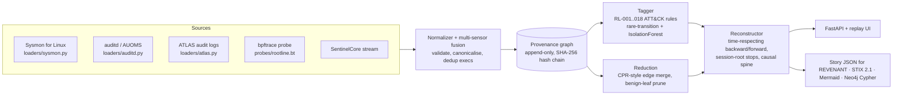

# ROOTLINE

[](https://github.com/rakshit-737/rootline/actions/workflows/ci.yml)

[](LICENSE)


**A small provenance-graph engine that reconstructs host attacks from syscall-level telemetry. Give it an alert or an IOC and it traces back to the root cause and forward to the blast radius.**

EDRs are heavy, closed and built around alerts. ROOTLINE is built around causality. It ingests process, file, network and exec events from Sysmon for Linux, auditd/AUOMS, ATLAS audit logs, the bpftrace probe or SentinelCore, and builds a per-host **provenance graph**. It then collapses benign repetition without cutting any causal path, tags suspicious vertices with ATT&CK-mapped rules plus an unsupervised model, and turns the slowest question in incident response into a graph query: *where did this start, and what did it touch?*

On the four public **ATLAS** attack scenarios, starting from the attacker IP that ATLAS gives its own investigator:

| | IOC grep (SIEM search) | Naive reachability | **ROOTLINE** |
|---|---|---|---|
| Event recall (mean S1–S4) | 0.040 | 0.999 | **0.999** |
| Event precision (mean) | 0.998 | 0.161 | **0.408** |
| Event F1 (mean) | 0.077 | 0.269 | **0.559** |
| Malicious-entity recall | 0.89 | 1.00 | **1.00** |

In every scenario, **graph reduction removes 3.8–4.4× of the edges and keeps 100 % of the attack edges**. Full tables are in [`results/RESULTS.md`](results/RESULTS.md) and the limitations are listed [below](#limitations).


## Contents

- [Architecture](#architecture) · [Quickstart](#quickstart) · [Results on real data](#results-on-real-data) · [Datasets](#datasets)
- [Reproducibility](#reproducibility) · [Prior art](#prior-art-and-how-this-differs) · [Limitations](#limitations) · [Roadmap](#roadmap) · [Safety](#safety)

## Architecture



| Module | File | What it does |
|---|---|---|
| Contracts | `models.py` | Frozen typed `Event`, `Node`, `Edge`, `Alert`, `Reconstruction` |
| Loaders | `loaders/` | Sysmon (XML, Syslog-JSON, syslog-prefixed), raw auditd with records grouped by serial, AUOMS, ATLAS line-labelled logs. Formats are sniffed automatically, and `merge_sources()` fuses sensors |
| Graph | `graph.py` | One vertex per process *image*: fork and exec each create a new vertex, so PID reuse is safe. Edges follow information flow. Every event extends a hash chain ([ADR 0001](docs/adr/0001-process-image-vertices.md)) |
| Reduction | `reduce.py` | Merges repeated edges unless new input arrived in between (the CPR rule), and prunes read-only loader noise. Alerted vertices are pinned ([ADR 0003](docs/adr/0003-causality-preserving-reduction.md)) |
| Tagger | `detect.py`, `rules_linux.py`, `anomaly.py` | 18 ATT&CK-mapped rules, a rare-transition model, and an IsolationForest process ranker (`[ml]` extra) |
| Reconstructor | `reconstruct.py` | Time-respecting traversal ([King & Chen 2003](docs/adr/0002-time-respecting-traversal.md)). It stops at session roots, ranks entry points, extracts the causal spine, maps kill-chain stages and collects IOCs |
| Export | `export.py` | `rootline.story/v1` JSON with the integrity head for the REVENANT handoff, a STIX 2.1 bundle validated with `stix2` in tests, Mermaid, and Neo4j Cypher |
| API / UI | `api.py`, `web/index.html` | Upload a capture, list stories, step through the replay (with shareable `#step` links) and download STIX. The UI has no dependencies |
| Benchmarks | `bench.py`, `scripts/bench.py` | ATLAS reconstruction, reduction and anomaly benchmarks, Splunk tagger coverage and OTRF sensor fusion |

The core engine uses only the standard library ([ADR 0005](docs/adr/0005-stdlib-core-optional-extras.md)). scikit-learn, FastAPI, stix2 and matplotlib are optional extras.

## Quickstart

Requires Python 3.10 or newer.

```bash
pip install -e ".[dev]"            # core + test deps (the core itself needs nothing)
python -m pytest -q                # 75 tests; real-data tests skip when the data is absent
rootline demo --outdir out         # synthetic intrusion -> story.json, stix.json, story.mmd

# A real capture: OTRF Log4Shell (CVE-2021-44228), with Sysmon and AUOMS fused into one host view
rootline analyze tests/fixtures/log4shell_sysmon.json tests/fixtures/log4shell_auoms.json \
        --story story.json --stix stix.json --mermaid story.mmd --cypher story.cypher

rootline analyze capture.log --ioc 203.0.113.66     # pivot on an IOC instead of the top alert
rootline analyze capture.log --iforest              # also rank process vertices with IsolationForest
rootline verify events.jsonl --head <hash>          # exit code 2 if the record was altered
rootline serve --fuse a.json b.json                 # API + replay UI on http://127.0.0.1:8000 ([api] extra)
docker compose up                                   # the same UI plus a Neo4j browser on :7474
```

Output on the committed Log4Shell excerpt:

```
[+] graph: {'events': 108, 'nodes': 105, 'edges': 111, 'process': 83, 'socket': 5, 'file': 17}
[+] alerts: 2
    RL-009  medium   T1140      base64 decoding: base64 -d
    RL-003  critical T1071      bash opened outbound connection to 192.168.2.6:443 (reverse shell / C2)
[*] pivot: RL-003 on bash[17806]
[*] root cause(s): ['192.168.2.6:8888', '192.168.2.6:1389']
[*] story: 13 nodes / 18 edges (backward 9, forward 4, accessed 2)
[*] IOCs: {"ipv4": ["192.168.2.6"], "files": [], "sha256": []}
```

The reverse shell traces back through `java[1340]` to the attacker's LDAP (`:1389`) and HTTP (`:8888`) callbacks, which is the JNDI exploitation chain.

`make` targets (`data`, `bench`, `demo`, `serve`, `lint`) wrap these commands. On Windows without `make`, set `PYTHONPATH=src` and run the commands in the [Makefile](Makefile) directly.

## Results on real data

All numbers come from `python scripts/bench.py` (a few minutes on a laptop; ATLAS alone takes about 1 minute) and are committed in [`results/`](results/). The protocol is fixed in [ADR 0004](docs/adr/0004-evaluation-protocol.md).

### 1. Attack reconstruction: ATLAS S1–S4

Every method starts from ATLAS' `user_artifact.txt`, the attacker IP handed to the investigator, and runs on the same graph. An event counts as predicted when both endpoints of its edge are in the story. It counts as true when ATLAS labels its log line malicious (`+`).


| Scenario (CVE) | Events | Attack events | Method | Story vertices | Precision | Recall | F1 |
|---|---|---|---|---|---|---|---|
| S1 (2015-5122, Flash) | 53,538 | 3,363 | IOC grep | 6 | 1.000 | 0.079 | 0.146 |
| | | | naive BFS | 4,735 | 0.084 | 0.999 | 0.155 |
| | | | **ROOTLINE** | **1,880** | **0.378** | **1.000** | **0.548** |
| S2 (2015-3105, Flash) | 50,390 | 9,519 | IOC grep | 8 | 1.000 | 0.017 | 0.033 |
| | | | naive BFS | 5,450 | 0.244 | 1.000 | 0.392 |
| | | | **ROOTLINE** | **3,246** | **0.502** | **1.000** | **0.669** |
| S3 (2017-11882, Office) | 68,835 | 3,689 | IOC grep | 9 | 0.992 | 0.033 | 0.065 |
| | | | naive BFS | 5,099 | 0.079 | 0.999 | 0.146 |
| | | | **ROOTLINE** | **2,677** | **0.161** | **0.996** | **0.277** |
| S4 (2017-0199, Office) | 71,044 | 11,624 | IOC grep | 9 | 1.000 | 0.033 | 0.064 |
| | | | naive BFS | 8,323 | 0.236 | 1.000 | 0.381 |
| | | | **ROOTLINE** | **5,893** | **0.590** | **0.999** | **0.742** |

At the same ~100 % recall, time-respecting traversal with session-root stops is **2.0–4.5× more precise** than plain reachability. It also produces 29–60 % smaller stories and never misses a malicious entity. Reconstruction takes 0.3–0.7 s per scenario.

### 2. Graph reduction (the spec's research question)

*How far can benign-subgraph reduction shrink provenance while preserving 100 % of attack-relevant paths?*

| Scenario | Edges before | Edges after | Reduction | Attack edges preserved |
|---|---|---|---|---|
| S1 | 54,589 | 12,548 | 4.35× | **100 %** |
| S2 | 58,327 | 15,348 | 3.80× | **100 %** |
| S3 | 69,994 | 16,586 | 4.22× | **100 %** |
| S4 | 72,237 | 19,000 | 3.80× | **100 %** |

Reduction is lossless for causality by construction ([ADR 0003](docs/adr/0003-causality-preserving-reduction.md)). As a result, the reconstruction scores with and without reduction are identical (see `rootline-noreduce` in RESULTS.md). The gain is graph size and memory. It does not change accuracy. Vertex counts do not change on ATLAS because the benign-leaf prune only matches Linux library, locale and `/etc` read paths.

### 3. Unsupervised vertex tagging (IsolationForest)

Process vertices are ranked per scenario with no labels, and the ranking is compared with ATLAS' malicious process images.

| Scenario | Processes | Malicious | IsolationForest first hit | Degree ranking first hit | Random (expected) |
|---|---|---|---|---|---|
| S1 | 324 | 2 | **rank 2** (recall@10 = 1.00) | rank 5 | 108 |
| S2 | 704 | 1 | **rank 1** (1.00) | rank 3 | 353 |
| S3 | 334 | 6 | **rank 2** (0.67) | rank 8 | 48 |
| S4 | 318 | 3 | rank 2 (0.67) | **rank 1** | 80 |

### 4. Rule coverage on real Linux telemetry (Splunk attack_data, Sysmon for Linux)

A capture counts as detected when at least one alert fires. The stricter column also requires the alert's ATT&CK technique to match the folder's technique. The **holdout** captures were never opened while the rules were written, so they are the numbers to quote.


| Split | Captures | v0.1 rules | v0.2 rules (any alert) | v0.2, same technique |
|---|---|---|---|---|
| dev (in-sample) | 45 | 3 (7 %) | 32 (71 %) | 27 (60 %) |
| **holdout** | 27 | 9 (33 %) | **12 (44 %)** | **5 (19 %)** |

The gap between dev and holdout is overfitting to the captures the rules were written from, and it is reported rather than hidden. The holdout misses cluster in sudo/doas/setuid abuse (T1548), kernel modules (T1547.006) and library hijacking (T1574.006).

### 5. Sensor fusion: OTRF Log4Shell (CVE-2021-44228)

| Input | Events | Alerts | Story vertices | Root causes | Reaches `java` | Reaches LDAP `:1389` |
|---|---|---|---|---|---|---|
| Sysmon only | 103 | 2 | 10 | none | no | no |
| **Sysmon + AUOMS** | 108 | 2 | 13 | `192.168.2.6:8888`, `192.168.2.6:1389` | **yes** | **yes** |

In this capture, Sysmon for Linux lacks the network events that link `java` to the payload fetch. Fusing in AUOMS's `connect` records is what closes the chain from the reverse shell back to the exploit ([ADR 0006](docs/adr/0006-multi-sensor-fusion.md)). The story is in [`results/log4shell_story.mmd`](results/log4shell_story.mmd).

### Comparison with published numbers

ATLAS (Alsaheel et al., USENIX Security 2021) reports **entity-level** results for a **supervised** LSTM trained on these scenarios. ROOTLINE is unsupervised graph traversal scored at **event level** against the same line labels, so the two sets of numbers are not directly comparable. On entity recall, ROOTLINE finds every malicious entity in S1–S4 (1.00), but its event-level precision is far below what a learned sequence model reports. See the limitations below.

## Datasets

Everything is downloaded **outside the repository** by `python scripts/download_data.py`, with SHA-256 checks against [`scripts/data_manifest.json`](scripts/data_manifest.json). Details and citations are in [docs/datasets.md](docs/datasets.md).

| Dataset | Content | Size | Licence |
|---|---|---|---|
| [ATLAS](https://github.com/purseclab/ATLAS) S1–S4 | 4 labelled Windows attack scenarios (audit + DNS + browser logs) | 14 MB zip | Apache-2.0 |
| [OTRF Security-Datasets](https://github.com/OTRF/Security-Datasets) | Log4Shell compound (Sysmon for Linux + AUOMS), two atomic auditd captures | < 1 MB | MIT |
| [Splunk attack_data](https://github.com/splunk/attack_data) | 73 Sysmon-for-Linux captures, one ATT&CK technique each (46 dev + 27 holdout) | ~0.3 GB | Apache-2.0 |

The data consists of event logs and pre-processed audit text only. No binaries are downloaded, and ATLAS model weights are skipped on extraction. **DARPA TC E3/E5** is not used: the dumps are hundreds of GB per host, and the ground truth is narrative rather than per-event (see [docs/datasets.md](docs/datasets.md#darpa-transparent-computing-not-used-and-why)).

## Reproducibility

```bash
pip install -e ".[dev,bench]"
python scripts/download_data.py          # ~0.4 GB into ../../datasets/rootline (override with ROOTLINE_DATA)
python -m pytest -q -m realdata          # tests that need the downloads
python scripts/bench.py                  # regenerates results/*.json, RESULTS.md and figures
```

The benchmarks are deterministic: IsolationForest uses a fixed seed and the traversals involve no randomness. CI runs lint, the test suite on Ubuntu and Windows with Python 3.10/3.12/3.13, a standard-library-only job, and a smoke test on the committed real Log4Shell excerpt. It needs none of the large downloads.

## Demo scenarios (from the spec)

1. **Root cause in one query.** On the synthetic intrusion, pivoting on the reverse-shell alert traces back to `invoice.docm`. On Log4Shell, it traces back to the JNDI callbacks.
2. **Blast radius.** The forward trace covers `/etc/shadow`, `id_rsa`, the crontab, `.bashrc`, staged loot and the deleted log (touched recall = 1.0, tested).
3. **Noise collapse.** ATLAS reduction is 3.8–4.4× with 100 % of attack edges kept. The synthetic story is 23 of 993 vertices.
4. **Anti-forensics.** Deleting `auth.log` is itself recorded, and editing or dropping any event breaks the hash chain (`verify` exits with code 2).
5. **Handoff.** Story JSON goes to REVENANT, STIX 2.1 goes to CTI, and Cypher goes to Neo4j.

## Prior art and how this differs

| Existing | What it does | ROOTLINE's angle |
|---|---|---|
| Falco | eBPF runtime rules that raise alerts | Alerts are ROOTLINE's *input*. It keeps the graph and reconstructs around them |
| Tetragon (Cilium) | eBPF observability and enforcement | Sensing is out of scope. The value is the reasoning layer |
| CamFlow, SPADE, DARPA TC systems | Whole-system provenance capture | Research-grade and heavy. ROOTLINE is a small, readable subset you can run and defend |
| ATLAS, DEPIMPACT, NoDoze, HOLMES | Learned or heuristic attack investigation | Research systems. ROOTLINE is an explainable traversal baseline evaluated on ATLAS' public labels |
| King & Chen *Backtracking Intrusions*; CPR / LogGC | The techniques ROOTLINE reimplements | An educational, integrable reimplementation. **No new science is claimed** |

## Limitations

- **Precision on ATLAS is modest (0.16–0.59).** ATLAS labels every line that involves a malicious entity, including benign services that merely read `payload.exe`. Traversal also pulls in benign activity inside the attacker's process tree. No causality-only method can reach perfect precision on these labels.
- **Reduction does not change accuracy.** It is designed to be lossless. More aggressive, lossy reduction (NodeMerge/templates) is future work.
- **The rules overfit.** Holdout coverage is 44 % with any alert and 19 % with the correct technique.
- **The eBPF probe is a documented reference.** It is not run in CI or on a live host from this Windows development machine ([ADR 0007](docs/adr/0007-ebpf-probe-as-reference.md)). Tamper resistance is shown with the hash chain, not measured in-kernel.
- The ATLAS scenarios are Windows. The Linux evidence comes from OTRF and Splunk, which are real but small single-technique captures.
- The SentinelCore field map is still an assumption until it is aligned with the real schema.
- Neo4j support is an export (Cypher script), not a live store. The docker-compose setup has not been tested in CI.

## Roadmap

- [x] Real-data loaders (Sysmon, auditd, AUOMS, ATLAS) and multi-sensor fusion
- [x] ATLAS / Splunk / OTRF benchmarks against baselines, with a held-out split
- [x] IsolationForest tagger, FastAPI + replay UI, STIX validation, Neo4j Cypher export
- [ ] DARPA TC CDM loader (streaming, one host subset) with community label sets
- [ ] ATLAS multi-host M1–M6 (the download is in the manifest as `--all`)
- [ ] libbpf CO-RE ring-buffer probe with fd→path for `write()`, run in a privileged Linux CI job
- [ ] Lossy template reduction, and a GNN node-anomaly stretch goal

## Safety

ROOTLINE **only observes**. The synthetic generator *writes event records* and executes nothing, and its IPs are RFC 5737 documentation addresses. Public datasets are logs only, with no binaries. The probe is attach-only (tracepoints and kprobes) and is for hosts you own. See [THREAT_MODEL.md](THREAT_MODEL.md) and [SECURITY.md](SECURITY.md).

## Contributing and licence

See [CONTRIBUTING.md](CONTRIBUTING.md), [CHANGELOG.md](CHANGELOG.md) and the ADRs in [docs/adr/](docs/adr/). The code is under the MIT licence ([LICENSE](LICENSE)). The datasets keep their own licences (listed above).
