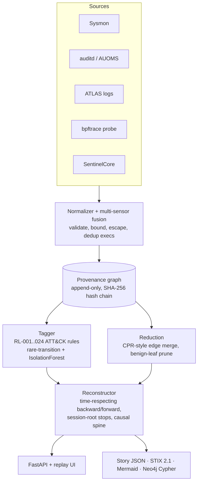
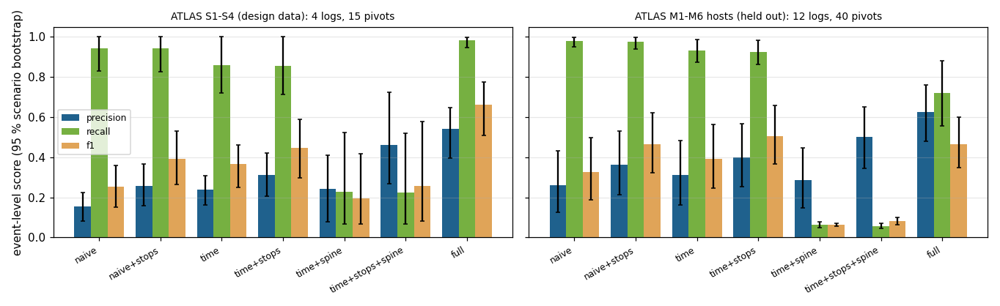

# ROOTLINE

[](https://github.com/rakshit-737/rootline/actions/workflows/ci.yml)
[](https://rakshit-737.github.io/rootline/)
[](https://github.com/rakshit-737/rootline/releases)

[](LICENSE)


**A small, explainable provenance-graph engine that reconstructs host attacks from syscall-level telemetry: give it an alert or an IOC and it traces back to the root cause and forward to the blast radius.**

**Contribution.** An open, training-free, time-respecting provenance reconstructor whose components are ablated on ATLAS with *held-out* hosts and whose sensor-to-story path runs on a *live kernel in CI*: on 12 held-out ATLAS host logs, session-root stops alone raise event precision from 0.26 to 0.36 at unchanged recall (33 of 34 pivots), and the full method reaches 0.63 precision at 0.72 recall; on the four scenarios it was designed on, it reaches F1 0.66 versus 0.25 for plain reachability. It does not match ATLAS's supervised model, and its rule tagger does not generalise. Both are measured and reported below.

| Result (all numbers traceable to [`results/`](results/)) | Number |
|---|---|
| ATLAS S1-S4 (design data): full method vs naive reachability, event F1 | **0.66** [0.51, 0.78] vs 0.25 [0.15, 0.36] |
| ATLAS M1-M6 hosts (**held out**): precision / recall / F1, full vs naive | 0.63 / 0.72 / 0.46 vs 0.26 / 0.98 / 0.33 (F1 gain +0.14 [-0.11, 0.35], not significant) |
| Session-root stops alone, held out | precision **+0.10** [0.07, 0.14] on 33 of 34 pivots, recall unchanged |
| ATLAS paper's own graph-traversal baseline vs ROOTLINE naive | P 0.18 vs 0.15-0.26: consistent |
| ATLAS LSTM, our reproduction under the paper's setup (entity F1) | 0.24-0.75 vs paper 0.89-1.00: **not reproduced** |
| Rule tagger v0.3: in-sample dev2 vs sealed | 23/27 vs **4/64** captures detected |
| Live bpftrace probe on a GitHub-hosted kernel | 41/42 CI jobs pass (9 pushes x 5 runs); the chain is recovered in **one query** in all 42 |


**Docs:** <https://rakshit-737.github.io/rootline/> · **Replay UI (static):** <https://rakshit-737.github.io/rootline/demo/> · [How it works](https://rakshit-737.github.io/rootline/how-it-works/) · [Evaluation](https://rakshit-737.github.io/rootline/evaluation/) · [Reproduce](https://rakshit-737.github.io/rootline/reproduce/)

## Try it in 60 seconds

```bash
docker run --rm -p 127.0.0.1:8000:8000 ghcr.io/rakshit-737/rootline:latest
# open http://127.0.0.1:8000 - the replay UI, preloaded with the OTRF Log4Shell capture
```

Or without Docker (Python 3.10+; the core needs no third-party packages):

```bash
git clone https://github.com/rakshit-737/rootline && cd rootline
pip install -e .
rootline analyze tests/fixtures/log4shell_sysmon.json tests/fixtures/log4shell_auoms.json
```

```text
[+] graph: {'events': 108, 'nodes': 105, 'edges': 111, 'process': 83, 'socket': 5, 'file': 17}  (rejected records: 0)
[+] alerts: 2
    RL-009  medium   T1140      base64 decoding: base64 -d
    RL-003  critical T1071      bash opened outbound connection to 192.168.2.6:443 (reverse shell / C2)
[*] pivot: RL-003 on bash[17806]
[*] root cause(s): ['192.168.2.6:8888', '192.168.2.6:1389']
[*] story: 13 nodes / 18 edges (backward 9, forward 4, accessed 2)
```

The reverse shell traces back through `java[1340]` to the attacker's LDAP (`:1389`) and HTTP (`:8888`) callbacks, which is the JNDI exploitation chain. The two files are the full OTRF capture from two sensors on one host (Sysmon for Linux and AUOMS), fused.

## Architecture



| Module | File | What it does |
|---|---|---|
| Probe | `probes/rootline.bt` | bpftrace, JSON records, PID self-filter, fd→path for writes, IPv4/IPv6 connect. Run live in CI ([ADR 0008](docs/adr/0008-live-ebpf-in-ci.md)) |
| Loaders | `loaders/` | Sysmon (XML, Syslog-JSON, syslog-prefixed), raw auditd grouped by serial, AUOMS, ATLAS line-labelled logs; formats sniffed; `merge_sources()` fuses sensors |
| Graph | `graph.py` | One vertex per process *image* (PID reuse is safe); edges follow information flow; every event extends a hash chain ([ADR 0001](docs/adr/0001-process-image-vertices.md)) |
| Reduction | `reduce.py` | Merges repeated edges unless new input arrived in between (CPR); lossless for causality ([ADR 0003](docs/adr/0003-causality-preserving-reduction.md)) |
| Tagger | `detect.py`, `rules_linux.py`, `rules_v03.py`, `anomaly.py` | 24 ATT&CK-mapped rules (v0.3 default), a rare-transition model, IsolationForest (`[ml]`) |
| Reconstructor | `reconstruct.py`, `ablation.py` | Time-respecting traversal ([King & Chen 2003](docs/adr/0002-time-respecting-traversal.md)), session-root stops, entry-point ranking, causal spine, IOCs; every component can be switched off for the ablation |
| Export | `export.py` | `rootline.story/v1` JSON with the integrity head, STIX 2.1 (validated with `stix2` in tests), Mermaid, Neo4j Cypher; all telemetry text escaped |
| API / UI | `api.py`, `web/index.html` | Upload a capture, list stories, step through the replay, download STIX; loopback-only, no dependencies in the UI |

The core engine uses only the standard library ([ADR 0005](docs/adr/0005-stdlib-core-optional-extras.md)). FastAPI, scikit-learn, stix2, matplotlib and torch are optional extras.

## Results

Methodology, all tables with confidence intervals and the comparison with the ATLAS paper are on the [Evaluation](https://rakshit-737.github.io/rootline/evaluation/) page; the tables are rendered from committed JSON into [`results/TABLES.md`](results/TABLES.md) by `scripts/render_tables.py`.

### 1. Which component buys the precision? (ATLAS ablation)

Every variant runs the same reconstructor with components switched off, from **every** ground-truth entity that maps to a vertex plus ATLAS's own starting IOC. S1-S4 are the scenarios the traversal heuristics were designed on; the 12 per-host logs of M1-M6 were never used for design. Intervals: 95 % scenario-cluster bootstrap.



| Variant | S1-S4 precision | S1-S4 recall | S1-S4 F1 | **Held-out** precision | **Held-out** recall | **Held-out** F1 |
|---|---|---|---|---|---|---|
| naive reachability | 0.15 | 0.94 | 0.25 | 0.26 | 0.98 | 0.33 |
| + session-root stops | 0.26 | 0.94 | 0.39 | 0.36 | 0.98 | 0.46 |
| time-respecting | 0.24 | 0.86 | 0.37 | 0.31 | 0.93 | 0.39 |
| time + stops | 0.31 | 0.86 | 0.45 | 0.40 | 0.93 | **0.51** |
| time + stops + spine (no accessed) | 0.46 | 0.22 | 0.26 | 0.50 | 0.06 | 0.08 |
| **full ROOTLINE** | **0.54** | **0.98** | **0.66** | **0.63** | 0.72 | 0.46 |

What it says: session-root stops are the component that transfers to unseen hosts (+0.10 precision on 33 of 34 held-out pivots, sign test p < 1e-6, recall unchanged). The causal spine only works together with the "accessed" expansion; on held-out hosts that pair buys precision at a real recall cost, and the best held-out F1 comes from time + stops alone. Root-cause hit@3 is about 0.45-0.48 for every variant, so entry-point ranking is the weakest part.

### 2. Comparison with the ATLAS paper (USENIX Security 2021)

| System | Level | Labels used | Precision | Recall | F1 |
|---|---|---|---|---|---|
| ATLAS Table 5: graph-traversal baseline (10 attacks) | event | no | 0.178 | 1.000 | 0.303 |
| ROOTLINE naive reachability (S1-S4 / held-out M hosts) | event | no | 0.15 / 0.26 | 0.94 / 0.98 | 0.25 / 0.33 |
| ROOTLINE full (S1-S4 / held-out M hosts) | event | no | 0.54 / 0.63 | 0.98 / 0.72 | 0.66 / 0.46 |
| ATLAS Table 4: LSTM (10 attacks) | event | yes | 0.999 | 0.999 | 0.999 |

ROOTLINE's naive reachability lands where the paper's own traversal baseline does. The supervised model is far better on paper. We tried to reproduce it: a PyTorch reimplementation of the ATLAS LSTM under the paper's setup (batch 1, 8 epochs, maxlen 400, 5 seeds; `repro/atlas_repro.py`, CI run 36997669262) reaches entity F1 0.30-0.65 with a regenerated training set and 0.24-0.75 with ATLAS's shipped training set, against the paper's 0.89-1.00. ATLAS's own shipped raw model output scores 0.33-0.71; the published numbers use a hand-"cleaned" entity list that, for S1, equals the ground truth. **The paper's numbers are not reproduced here.**

Caveats on the comparison: ROOTLINE can represent 63-73 % of the lines ATLAS labels as attack (no browser or pid-less rows), so a recall against all attack lines would be lower by that factor; the paper starts S-2 and S-4 from a leaked file; ATLAS trains leave-one-attack-out.

### 3. From the analyst IOC, one pivot per log


Starting only from ATLAS's `user_artifact.txt` (the attacker address), on the same graph (means over logs; per-log rows in [`results/RESULTS.md`](results/RESULTS.md)):

| Logs | Method | Precision | Recall | F1 | Story vertices |
|---|---|---|---|---|---|
| S1-S4 (in-sample) | IOC grep (seed + one hop) | 0.998 | 0.040 | 0.077 | 8 |
| | naive reachability | 0.161 | 1.000 | 0.269 | 5,902 |
| | **ROOTLINE** | **0.408** | **0.999** | **0.559** | 3,424 |
| M1-M6 hosts (held out) | IOC grep | 0.999 | 0.034 | 0.065 | 5 |
| | naive reachability | 0.154 | 0.998 | 0.250 | 6,308 |
| | **ROOTLINE** | 0.673 | 0.597 | 0.360 | 2,149 |

The S1-S4 numbers are identical to v1.0. On the held-out hosts the result splits: on the six first-hop (h1) hosts ROOTLINE keeps recall above 0.99, but on five of the six second-hop (h2) hosts, where the attacker address appears only in a few lateral connections, the story collapses to 12-17 vertices (recall 0.02-0.06). Reduction removes 3.8-5.8x of the edges across all 16 logs; it is lossless by construction (it keeps the first edge of every source-target-relation key), and the empirical check is that stories with and without it are identical.

### 4. Rule coverage: dev / dev2 / sealed (Splunk attack_data)

The v1.0 holdout was burned once its misses were published and used to write v0.3, so it is now `dev2`. A new **sealed** split (160 Linux captures, pinned by LFS SHA-256 at `attack_data@b4573ed3`, selected from the tree listing only) was scored **once** with the frozen v0.3 rules in CI run 36994398382 after a hash check of the rules, loaders and normaliser ([protocol](docs/protocol.md), [ADR 0009](docs/adr/0009-sealed-rule-protocol.md)).


| Split | Captures | Unparsed | v0.3 detected | v0.3 same technique | Alert precision (proxy) |
|---|---|---|---|---|---|
| dev (in-sample) | 46 | 1 | 34/45 (76 %) [0.61, 0.86] | 27/45 (60 %) [0.46, 0.73] | 0.80 |
| dev2 (burned, in-sample) | 27 | 0 | 23/27 (85 %) [0.68, 0.94] | 14/27 (52 %) [0.34, 0.69] | 0.37 |
| **sealed** | 160 | 96 | **4/64 (6 %)** [0.03, 0.15] | **1/64 (2 %)** [0.00, 0.08] | 0.20 |
| sealed, techniques never seen in dev/dev2 | 73 | 45 | 2/28 [0.02, 0.23] | 0/28 [0.00, 0.12] | 0.00 |

The rules do not generalise beyond the captures they were written from, and the frozen loaders cannot parse most of the sealed auditd variants. Both are reported as measured. Technique match is at parent-technique level; 5 of the 73 dev/dev2 captures are malware families, which can never match a technique.

### 5. Live kernel evidence (CI)

The `live-ebpf` job runs `probes/rootline.bt` with sudo on the ubuntu-24.04 runner kernel (6.17, bpftrace 0.20.2) while a benign, attack-shaped chain runs entirely inside the runner: a dummy interface carries a TEST-NET "remote" server, `HOME` is a throwaway directory, the credentials are AWS's documented example key. One query from the dropped script's process finds the download socket `198.51.100.7:8081` and the script as root causes and the credential read, unit and cron-style writes, history deletion and both listener connections in a 28-vertex story; RL-002/004/005/006 fire; zero lost events; a decoy that renamed itself `bpftrace` is still captured. Five matrix runs per push; over the 9 pushes to main since probe v1.2, 41 of 42 completed jobs passed (Wilson 95 % [0.88, 1.00]); the one failure was an over-strict fork-parent check, since corrected, and the chain was recovered in all 42 ([`results/live_ebpf.json`](results/live_ebpf.json), story in [`results/live_ebpf_story.mmd`](results/live_ebpf_story.mmd)). Caveats: bpftrace, not a libbpf CO-RE probe; a scripted benign chain; relative paths are not resolved.

### 6. Sensor fusion: OTRF Log4Shell (CVE-2021-44228)

| Input | Events | Alerts | Story vertices | Root causes | Reaches `java` | Reaches LDAP `:1389` |
|---|---|---|---|---|---|---|
| Sysmon only | 103 | 2 | 10 | none | no | no |
| **Sysmon + AUOMS** | 108 | 2 | 13 | `192.168.2.6:8888`, `192.168.2.6:1389` | **yes** | **yes** |

Sysmon for Linux lacks the network events that link `java` to the payload fetch; fusing AUOMS's `connect` records closes the chain ([ADR 0006](docs/adr/0006-multi-sensor-fusion.md)).

## Datasets

Downloaded **outside the repository** by `python scripts/download_data.py` into `$ROOTLINE_DATA` (default `~/.cache/rootline`), pinned to upstream commits and checked by SHA-256 and size ([docs/datasets.md](docs/datasets.md)).

| Dataset | Content | Size | Licence |
|---|---|---|---|
| [ATLAS](https://github.com/purseclab/ATLAS) S1-S4 and M1-M6 | Labelled Windows attack scenarios (audit + DNS + browser logs) | 14 MB + 62 MB zips | Apache-2.0 |
| [OTRF Security-Datasets](https://github.com/OTRF/Security-Datasets) | Log4Shell compound (Sysmon for Linux + AUOMS), two atomic auditd captures | < 1 MB | MIT |
| [Splunk attack_data](https://github.com/splunk/attack_data) | 46 dev + 27 dev2 + 160 sealed Linux captures | 6.5 MB + 716 MB + 1.8 MB | Apache-2.0 |

The default download is 78 files, 736.5 MB. Logs only: no binaries, and ATLAS model weights are skipped on extraction. DARPA TC and ATLASv2 are not used ([why](docs/datasets.md)).

## Reproduce

```bash
pip install -e ".[dev,bench]"
export ROOTLINE_DATA=~/rootline-data
python scripts/download_data.py && python scripts/download_data.py --source atlas --all
python scripts/bench.py --only atlas     # results/atlas.json, RESULTS.md, figures (~25 min)
python scripts/ablation.py               # results/ablation.json (~13 min)
python scripts/render_tables.py          # results/TABLES.md
```

The sealed coverage, the live eBPF runs and the LSTM reproduction run in GitHub Actions (`sealed-coverage`, `ci.yml` job `live-ebpf`, `atlas-repro`). Exact commands, runtimes and expected numbers: [Reproduce](https://rakshit-737.github.io/rootline/reproduce/). CI runs lint, tests on Ubuntu and Windows with Python 3.10-3.14, a standard-library-only job, a Docker smoke test, a docker-compose job that imports the story into Neo4j, and the live eBPF job.

## Prior art and how this differs

| Existing | What it does | ROOTLINE's angle |
|---|---|---|
| Falco, Tetragon | eBPF runtime rules / observability | Alerts are ROOTLINE's *input*; it keeps the graph and reconstructs around them |
| CamFlow, SPADE, DARPA TC systems | Whole-system provenance capture | A small, readable reasoning layer you can run and audit |
| ATLAS, DEPIMPACT, NoDoze, HOLMES | Learned or heuristic attack investigation | A training-free traversal whose components are ablated on ATLAS with held-out hosts, plus an attempted reproduction of ATLAS itself |
| King & Chen *Backtracking Intrusions*; CPR / LogGC | Time-respecting backtracking; causality-preserving reduction | ROOTLINE reimplements both; what it adds is the measured contribution of each component (session-root stops transfer, the spine does not on its own) and an end-to-end live-kernel check |

## Limitations

- The reconstructor was designed on ATLAS S1-S4; on held-out hosts its F1 gain over naive reachability is not significant, and entry-point ranking is weak (root-cause hit@3 about 0.45).
- Precision on ATLAS stays modest (0.54-0.63) because ATLAS labels every line touching a malicious entity, including benign readers.
- The rule tagger does not generalise (4/64 sealed); most sealed auditd captures are not parsed.
- The live probe check is bpftrace on a scripted benign chain; relative paths, `dup()`/`fcntl` and fork-inherited fds are not resolved.
- The ATLAS LSTM reproduction does not reach the published numbers.
- Full list: [Limitations](docs/limitations.md).

## Safety

ROOTLINE **only observes**. The synthetic generator writes event records and executes nothing; its IPs are RFC 5737 documentation addresses. Public datasets are logs only. The probe is attach-only and for hosts you own; the CI chain uses dummy files and traffic that never leaves the runner. The API has no authentication and binds to loopback. See [THREAT_MODEL.md](THREAT_MODEL.md) and [SECURITY.md](SECURITY.md).

## Contributing, citing and licence

See [CONTRIBUTING.md](CONTRIBUTING.md), [CHANGELOG.md](CHANGELOG.md), the ADRs in [docs/adr/](docs/adr/) and [CITATION.cff](CITATION.cff). Code under the MIT licence ([LICENSE](LICENSE)); datasets keep their own licences.
