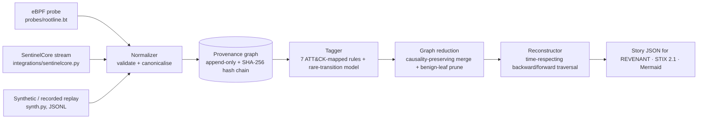

# ROOTLINE

**A minimal provenance-graph engine that turns syscall-level host telemetry into a replayable attack story: backward to the root cause, forward to the blast radius.**

EDRs are heavy, closed, and built around alerts. ROOTLINE is built around causality. It ingests process, file, network, and exec events (from eBPF, SentinelCore, or recorded/synthetic replays) and builds a per-host **provenance graph**. It shrinks benign repetition without breaking any causal path, tags suspicious vertices with explainable rules plus a rare-transition anomaly model, and then answers the slowest question in incident response as a graph query: *where did this start, and what did it touch?*

```
[*] pivot: RL-003 on .x[1188]
[*] root cause(s): ['/home/alice/Downloads/invoice.docm', '/tmp/.x', '203.0.113.66:4444']
[*] story: 23 nodes / 25 edges   (from 4,328 events / 993 vertices)
[*] kill chain:
    initial-access: /home/alice/Downloads/invoice.docm
    delivery: curl[1187] wrote /tmp/.x
    execution: soffice[1186] spawned sh[1186]  (+3 more)
    persistence: bash[1189] wrote /var/spool/cron/crontabs/alice  (+1 more)
    credential-access: /etc/shadow was read by bash[1189]  (+1 more)
    defense-evasion: bash[1189] deleted /var/log/auth.log
    command-and-control: .x[1188] connected to 203.0.113.66:4444  (+1 more)
```

## Architecture



| Module | File | What it does |
| --- | --- | --- |
| Contracts | `models.py` | Frozen typed `Event`, `Node`, `Edge`, `Alert`, `Reconstruction` |
| Normalizer | `normalize.py` | JSONL / bpftrace `k=v` lines to validated `Event`s. Rejects malformed input, bounds strings, collapses `../` paths |
| Graph | `graph.py` | One vertex per process *image* (fork and exec each create a new vertex, so PID reuse is handled). Edges follow information flow. Every event extends a hash chain |
| Reduction | `reduce.py` | Merges repeated edges unless new input arrived in between (the CPR rule). Prunes read-only loader noise. Alerted vertices are pinned |
| Tagger | `detect.py` | Rules RL-001..007 (doc handler spawns a shell, exec from a writable directory, shell/implant C2, credential reads, persistence writes, log deletion, payload download) plus the `RareTransitionModel` baseline |
| Reconstructor | `reconstruct.py` | Time-respecting traversal (King & Chen 2003). Stops at session roots, ranks entry points, extracts the causal spine, kill-chain stages, and IOCs |
| Export | `export.py` | `rootline.story/v1` JSON (REVENANT handoff, with the integrity head), a hand-built STIX 2.1 bundle, and Mermaid |
| Evaluation | `evaluate.py` | Root-cause accuracy, blast-radius recall and precision, attack-edge preservation, reduction ratio |
| CLI | `cli.py` | `synth`, `analyze`, `verify`, `demo` |

## Quickstart

Python 3.10 or newer. The runtime has **no third-party dependencies**.

```bash
pip install -e ".[dev]"
make test        # pytest (48 tests)
make demo        # synthetic attack -> story.json, stix.json, story.mmd in ./out

rootline synth --out events.jsonl --truth truth.json --benign 400
rootline synth --out baseline.jsonl --no-attack --seed 1
rootline analyze events.jsonl --baseline baseline.jsonl --story story.json --stix stix.json --mermaid story.mmd
rootline analyze events.jsonl --ioc 203.0.113.66     # pivot on an IOC instead of an alert
rootline verify events.jsonl                          # print hash-chain head
rootline verify events.jsonl --head <hash>            # exit 2 if the record was altered
```

Without `make` (Windows): `set PYTHONPATH=src` and then `python -m pytest` / `python -m rootline.cli demo`.

On a Linux lab VM you own, run `sudo bpftrace probes/rootline.bt > capture.log`, then `rootline analyze capture.log`.

## Demo scenarios (from the spec)

1. **Root cause in one query.** Pivot on the reverse-shell alert, and the backward trace reaches `invoice.docm` (tested).
2. **Blast radius.** The forward trace plus the files accessed afterwards cover `/etc/shadow`, `id_rsa`, the crontab, `.bashrc`, the staged loot, and the deleted log (tested; touched recall = 1.0).
3. **Noise collapse.** About 2x edge reduction on the synthetic workload, with 100% of attack edges preserved (tested). The story is roughly 23 of about 1,000 vertices.
4. **Anti-forensics resilience.** Deleting `auth.log` is itself recorded. Dropping or editing any event breaks the hash chain (`verify` exits 2; tested).
5. **Handoff.** The story JSON goes to REVENANT, and the STIX bundle goes to CTI.

## Prior art and how this differs

| Existing | What it does | ROOTLINE's angle |
| --- | --- | --- |
| Falco | eBPF runtime rules that raise alerts | Alerts are the *input*. ROOTLINE keeps the graph and reconstructs around them |
| Tetragon (Cilium) | eBPF process and network observability and enforcement | Sensing is out of scope (it reuses a sensor); the value is the reasoning layer |
| CamFlow, SPADE, DARPA TC systems | Whole-system provenance capture | Research-grade and heavy. ROOTLINE is a small, readable subset (~1k LOC) you can run and defend |
| Sysmon for Linux + SIEM | Event logging | Events, not causality |
| King & Chen *Backtracking Intrusions*; CPR / LogGC reduction | The techniques ROOTLINE reimplements | An educational, integrable reimplementation. **No new science is claimed** |

## Status and TODO (Grade C/D/E, deliberately out of MVP scope)

- [ ] **eBPF probes, live (C/D).** `probes/rootline.bt` is a reference and is not exercised in CI. Still needed: fd-to-path resolution for `write()`, IPv6, self-PID filtering, and a libbpf ring-buffer port.
- [ ] **SentinelCore integration (C).** `integrations/sentinelcore.py` is a guessed field map. It must be aligned with the real schema.
- [ ] **Public datasets (C).** Loaders for DARPA TC (CDM) and ATLASv2 so recall can be evaluated on real labeled provenance.
- [ ] **IsolationForest tagger (B/C).** The current `RareTransitionModel` is a dependency-free stand-in.
- [ ] **Neo4j persistence plus FastAPI and a React attack-replay UI (B).** The graph is in memory today.
- [ ] **STIX validation (B).** Run `python-stix2` against the bundle in CI.
- [ ] **Stronger reduction (D).** Full CPR/NodeMerge-style templates, and the research question: *how far can reduction go while keeping 100% of attack paths?*
- [ ] **GNN node anomaly (D/E).** A stretch goal.
- [ ] **Live attack generation (D).** Replaced by the synthetic generator and public datasets.

## Safety

ROOTLINE **only observes**. The synthetic generator *writes event records* and executes nothing. Its IPs are RFC 5737 documentation addresses. The probe is attach-only (tracepoints and kprobes) and must run only on hosts you own. See [THREAT_MODEL.md](THREAT_MODEL.md) and [SECURITY.md](SECURITY.md).
