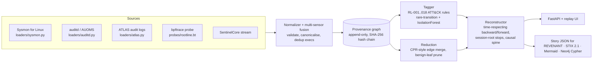

# Architecture

| Module | File | What it does |
|---|---|---|
| Contracts | `models.py` | Frozen typed `Event`, `Node`, `Edge`, `Alert`, `Reconstruction` |
| Loaders | `loaders/` | Sysmon (XML, Syslog-JSON, syslog-prefixed), raw auditd with records grouped by serial, AUOMS, ATLAS line-labelled logs. Formats are sniffed automatically, and `merge_sources()` fuses sensors |
| Graph | `graph.py` | One vertex per process *image*: fork and exec each create a new vertex, so PID reuse is safe. Edges follow information flow. Every event extends a hash chain ([ADR 0001](adr/0001-process-image-vertices.md)) |
| Reduction | `reduce.py` | Merges repeated edges unless new input arrived in between (the CPR rule), and prunes read-only loader noise. Alerted vertices are pinned ([ADR 0003](adr/0003-causality-preserving-reduction.md)) |
| Tagger | `detect.py`, `rules_linux.py`, `anomaly.py` | 18 ATT&CK-mapped rules, a rare-transition model, and an IsolationForest process ranker (`[ml]` extra) |
| Reconstructor | `reconstruct.py` | Time-respecting traversal ([King & Chen 2003](adr/0002-time-respecting-traversal.md)). It stops at session roots, ranks entry points, extracts the causal spine, maps kill-chain stages and collects IOCs |
| Export | `export.py` | `rootline.story/v1` JSON with the integrity head for the REVENANT handoff, a STIX 2.1 bundle validated with `stix2` in tests, Mermaid, and Neo4j Cypher |
| API / UI | `api.py`, `web/index.html` | Upload a capture, list stories, step through the replay (with shareable `#step` links) and download STIX. The UI has no dependencies |
| Benchmarks | `bench.py`, `scripts/bench.py` | ATLAS reconstruction, reduction and anomaly benchmarks, Splunk tagger coverage and OTRF sensor fusion |

The core engine uses only the standard library ([ADR 0005](adr/0005-stdlib-core-optional-extras.md)). scikit-learn, FastAPI, stix2 and matplotlib are optional extras.

## Data flow

1. **Load.** Loaders sniff the format and emit typed `Event`s; `merge_sources()` fuses sensors on one host and deduplicates execs.
2. **Graph.** Every event extends the SHA-256 hash chain and adds information-flow edges between process-image, file and socket vertices.
3. **Tag.** Rules, the rare-transition model and (optionally) IsolationForest produce `Alert`s.
4. **Reduce.** Repeated edges are merged unless new input arrived in between; alerted vertices are pinned.
5. **Reconstruct.** Time-respecting backward and forward traversal from the pivot, stopping at session roots.
6. **Export.** Story JSON, STIX 2.1, Mermaid, Cypher.
