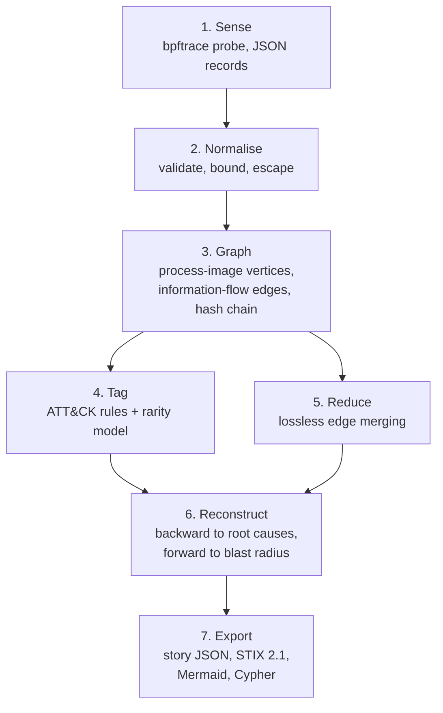

# How it works

This page follows one real capture from kernel events to an attack story: the benign,
attack-shaped chain that the `live-ebpf` CI job runs on a GitHub-hosted Ubuntu kernel
(see [ADR 0008](adr/0008-live-ebpf-in-ci.md)). Every artefact shown here is committed:
the capture is `tests/fixtures/live_chain_ci_v12.jsonl`, the result is
`results/live_ebpf.json` and the story is `results/live_ebpf_story.mmd`.



## 1. Sense

The probe (`probes/rootline.bt`) attaches to process-creation, exec, open, write,
dup2/dup3, close, unlink, TCP-connect and exit hooks. It runs with `-f json`, so every
record is one JSON string and a file name with a newline in it cannot fake a second
record. These three records are the download and the exec of the dropped script:

```json
{"type": "printf", "data": "tsns=236840773943 kind=openat pid=2902 ppid=2901 uid=1001 flags=O_WRONLY fd=6 path=/tmp/rootline-lab-stage.sh comm=curl\n"}
{"type": "printf", "data": "tsns=236840849236 kind=write pid=2902 ppid=2901 uid=1001 fd=6 path=/tmp/rootline-lab-stage.sh comm=curl\n"}
{"type": "printf", "data": "tsns=236842960472 kind=execve pid=2901 ppid=2899 uid=1001 path=/tmp/rootline-lab-stage.sh comm=rootline-lab-st\n"}
```

The `write` record carries a path even though `write()` only receives a file descriptor:
the probe remembers which path each writable fd was opened as (and follows `dup2`), keyed
by process and process start time so a recycled PID never inherits stale entries. The
probe excludes its own PID (not its name), and only new thread groups count as new
processes.

## 2. Normalise

`rootline.normalize` parses each record with an anchored pattern: time, kind, pids and uid
are numeric fields in fixed positions, the free-text path comes next and the process name
(at most 15 bytes) comes last. A crafted name can therefore garble only its own text,
never the event kind or the pids. Control characters are made visible (`\x0a`),
timestamps must be finite, and malformed records are counted as rejected rather than
crashing ingestion.

## 3. Build the provenance graph

Every exec creates a new **process-image vertex** (`curl[2902]`), so a PID that runs
`bash` and then the dropped script becomes two vertices ([ADR 0001](adr/0001-process-image-vertices.md)).
Edges point the way information flows: a socket *sends data to* the process that connected,
a process *writes* a file, a file *is executed as* a process. Every event also extends a
SHA-256 hash chain, so `rootline verify` detects any edit, drop or reorder of the record.

## 4. Tag

Rules map edge patterns to ATT&CK techniques. On this capture: RL-002 (a file written by a
network-facing process is executed from `/tmp`), RL-004 (credential file read), RL-005
(persistence location written), RL-006 (shell history deleted), RL-003 and RL-007.

## 5. Reduce

Repeated edges are merged unless new information reached the source in between (the CPR
rule), and read-only library noise is pruned. This is lossless for causality by design
([ADR 0003](adr/0003-causality-preserving-reduction.md)); on the 16 ATLAS logs it removes 3.8–5.8× of
the edges and leaves every story unchanged.

## 6. Reconstruct

Pivoting on the stage process, ROOTLINE walks **backward** only along edges that happened
before the influence arrived (King & Chen's time-respecting rule), stops at session roots
such as `sshd` or `systemd`, ranks entry points, keeps only the **causal spine** from those
entry points to the pivot, then walks **forward** from the pivot for the blast radius and
adds what intrusion-created processes read. One query gives this story (root causes in red):

```mermaid
--8<-- "results/live_ebpf_story.mmd"
```

The root causes are the dropped script and the socket it was downloaded from
(198.51.100.7:8081, a TEST-NET address on a dummy interface inside the runner). The
forward slice holds the credential read, the unit and cron-style writes, the deleted
history and both listener connections. The relative names `.config`, `lab` and `systemd`
are `mkdir -p` opening path components relative to its cwd; resolving those is a known
probe gap.

The [Evaluation](evaluation.md) page measures what each of these components contributes on
ATLAS by switching them off one at a time.

## 7. Export

The story is written as `rootline.story/v1` JSON (with the hash-chain head), a STIX 2.1
bundle, Mermaid, and a Neo4j Cypher script in which all telemetry strings are quoted
literals. The [replay UI](demo/index.html) steps through the same story event by event.

## The same pipeline on a real intrusion: Log4Shell

On the OTRF Log4Shell capture (Sysmon for Linux and AUOMS fused), the reverse-shell alert
traces back through `java[1340]` to the attacker's LDAP (`:1389`) and HTTP (`:8888`)
callbacks, which is the JNDI exploitation chain:

```mermaid
--8<-- "results/log4shell_story.mmd"
```
